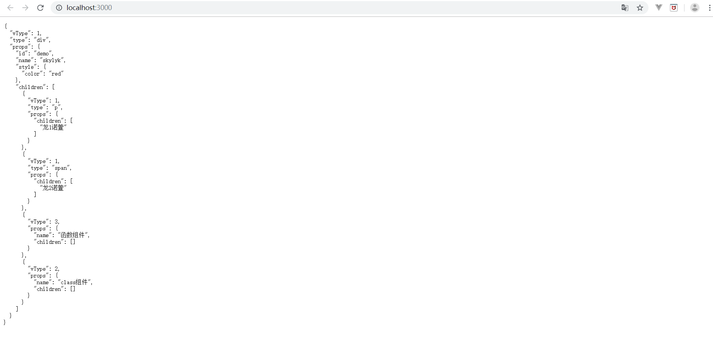

# react源码初识

## 目标
- react的render过程和具体逻辑
- 虚拟dom的构建过程，diff算法的具体逻辑

先贴一段githup上react的一截源码，[链接附上](https://github.com/facebook/react/blob/master/packages/react/src/React.js)

<<< @/markdown/progress/6-2/1.js

上述就是react的核心api列表，这截看起来还是很简单的是不是:tada:。其实上述核心精简之后就变成了

<<< @/markdown/progress/6-2/2.js

先来实现一下react的render过程，也就是上述的createElement。

## render

### 前置知识

我们都知道React 使用 JSX 来替代常规的 JavaScript，附上一个[蜗牛老师的网站](http://react.shengxinjing.cn/)，可以在线转换jsx和js。
通过蜗牛老师的网站，可以了解到

<<< @/markdown/progress/6-2/3.js

其实就是在执行

<<< @/markdown/progress/6-2/4.js

知道了上述就可以create-react-app，创建一个原始的react项目，把index.js里面的东西都删除，只留下下述代码

<<< @/markdown/progress/6-2/5.js

把原先的react.js和react-dom.js都换成自己写的分别写的

<<< @/markdown/progress/6-2/6.js

执行命令运行文件在浏览器种可以看到时可以console出createElement方法的参数的，arguments如下图

### 具体实现

上述都是再说一些前置知识，到现在就是实打实的具体实现render的过程了。
之前已经新建了sky-react.js以及sky-react-dom.js,再新增一个处理构建dom的sky-vdom.js文件，后续初始化属性值生成文本节点都放在这里处理，如下

<<< @/markdown/progress/6-2/7.js

分别修改sky-react.js以及skt-react-dom.js，

<<< @/markdown/progress/6-2/8.js

此时执行代码在页面中可以呈现简洁的dom树结构

但是在react中有三种类型的组件
1. dom组件
2. 函数式组件
3. class组件
上述只是一种dom组件，(ps/其实还有一种纯文本组件),所以我们还需要有一个标识来判断当前是哪一种组件,修改sky-react.js

<<< @/markdown/progress/6-2/9.js

sky-vdom.js中的方法此时便多了一个参数

<<< @/markdown/progress/6-2/10.js

此时在index.js中再新增函数式组件和class组件，再页面中便可以看到效果

<<< @/markdown/progress/6-2/11.js

dom树已经对应，接下来就是实打实递归构建dom树。
修改sky-vdom.js,新增初始化dom的方法

<<< @/markdown/progress/6-2/12.js

此时dom节点已经构建完毕只要追加到html中就可以了

<<< @/markdown/progress/6-2/13.js

以上就是react中render的简易过程，我们可以看到设置的style红色也已经有了效果。

